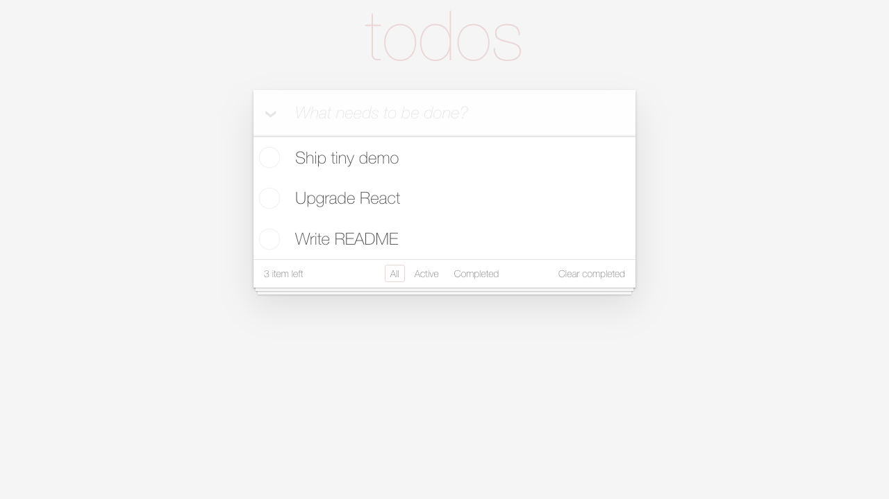

<div align="center">
  <h1>✅ TodoList</h1>
  
  
  <br>
  木犀团队的 React Hook 练习项目<br>
  一个轻量的 TodoList 小 demo，用来练习组件拆分、状态管理和本地数据保存。
</div>

## ✨ 页面预览

<p align="center">
  
</p>

## 🧭 你可以做什么

- 添加待办事项
- 标记单项或全部待办为完成
- 双击编辑待办内容
- 按全部 / 未完成 / 已完成筛选
- 清除已完成待办
- 使用 `localStorage` 保存数据

## 🛠 使用技术

- React 19
- Vite 8
- nanoid

## 🚀 本地运行

```bash
npm install
npm run dev
```

打开 Vite 输出的本地地址即可预览，通常是：

```text
http://127.0.0.1:5173/
```

## 📦 构建

```bash
npm run build
```

## 📄 授权

本项目使用 [MIT License](LICENSE)。
